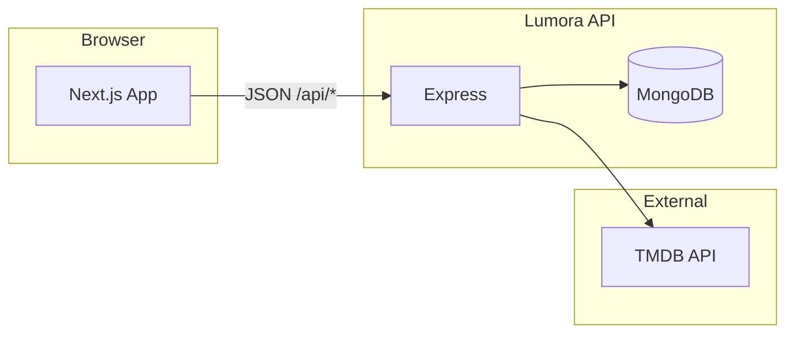

<div align="center">

# Lumora

**A cinematic streaming MVP** — browse films and series with a dark, refined UI, TMDB-powered catalog, and a small but solid Express API behind it.

[](https://nextjs.org/)
[](https://react.dev/)
[](https://expressjs.com/)
[](https://www.mongodb.com/)

*Monorepo · App Router · CSS Modules · JWT · TMDB*

</div>

---

## Table of contents

- [Why Lumora](#why-lumora)
- [At a glance](#at-a-glance)
- [Architecture](#architecture)
- [Repository layout](#repository-layout)
- [Tech stack](#tech-stack)
- [Features](#features)
- [Quick start](#quick-start)
- [Environment variables](#environment-variables)
- [Scripts](#scripts)
- [API reference](#api-reference)
- [Pagination & catalog](#pagination--catalog)
- [Frontend routes](#frontend-routes)
- [Deployment (Render)](#deployment-render)
- [Troubleshooting](#troubleshooting)
- [Security](#security)
- [Acknowledgements](#acknowledgements)

---

## Why Lumora

Lumora is built as a **portfolio-grade streaming prototype**: enough surface area to feel like a real product (auth, grids, filters, detail pages, user lists), but still small enough to read end-to-end in an afternoon. The UI leans into **deep backgrounds, violet accents, and calm typography** — closer to a premium theatre lobby than a generic dashboard.

If you are here to **run it locally**, **extend the API**, or **ship a demo**, the sections below are written in that order.

---

## At a glance

| | |
| --- | --- |
| **Shape** | npm workspaces — `apps/frontend`, `apps/backend`, `packages/shared` |
| **Data** | TMDB for catalog & images; MongoDB for users and private lists |
| **Auth** | JWT access + refresh (Bearer header); refresh token stored on the user |
| **Deploy** | [`render.yaml`](render.yaml) blueprint for backend + frontend |

---

## Architecture

High-level request flow: the Next.js app talks to the API under `NEXT_PUBLIC_API_URL` (must end with `/api`). The backend proxies TMDB and persists user-specific state in MongoDB.



---

## Repository layout

```text
lumora/
├── apps/
│   ├── frontend/          # Next.js 14 (App Router), UI & client flows
│   └── backend/         # Express API, JWT, TMDB integration
├── packages/
│   └── shared/          # Shared TypeScript types (@lumora/shared)
├── render.yaml          # Render: backend + frontend services
├── package.json         # Workspace root scripts
└── README.md            # You are here
```

---

## Tech stack

| Layer | Choices |
| --- | --- |
| **Frontend** | Next.js 14 · React 18 · TypeScript · CSS Modules · design tokens in [`apps/frontend/src/styles/tokens.css`](apps/frontend/src/styles/tokens.css) |
| **Backend** | Express · Mongoose · `helmet` · CORS · rate limit · `trust proxy` for reverse proxies |
| **Integrations** | [The Movie Database (TMDB)](https://www.themoviedb.org/) API · YouTube thumbnails for trailers (`next.config.js` remote patterns) |
| **Shared** | [`packages/shared`](packages/shared) — e.g. `ContentItem`, `UserState` |

---

## Features

### Experience

- **Home** — hero + trending-style rows fed from featured TMDB data.
- **Browse** — dedicated pages for **Movies**, **Series**, and **Cartoons** with a filter panel and paginated grids.
- **Search** — query-driven results with pagination.
- **Title detail** — rich page with media, recommendations, and deep links.
- **Watch** — trailer-first watch flow with embedded player where available.
- **Favorites** — authenticated list of saved titles (client-side token gate + redirect).

### Filters & discovery

- **Title search** vs **discover filters** are mutually exclusive in the URL layer (backend switches between TMDB search and discover).
- **Ranges** — release year and vote-average style rating sliders.
- **Facets** — genre, country, language via custom selects (portal positioning for small screens).

### Account & personalization

- Register / login / refresh / logout; profile bootstrap from `/auth/me`.
- **Favorites**, **Watch later**, and **ratings (1–5)** on each card (menu actions).
- **Subscription** model: `free` | `premium` (API + UI affordances).

### Pagination (grid-aware)

- Wide layouts use **21 items per page**; narrower layouts use **20** — aligned with the responsive column count so rows feel “full” on desktop.
- Backend implements this on top of TMDB’s fixed page size of 20 (merge + slice when needed). See [Pagination & catalog](#pagination--catalog).

---

## Quick start

### Prerequisites

- **Node.js** 18+ and **npm** 9+
- **MongoDB** reachable from your machine
- A **TMDB API key** ([TMDB settings](https://www.themoviedb.org/settings/api))

### 1. Install

```bash
npm install
```

### 2. Environment

- Backend: copy [`apps/backend/.env.example`](apps/backend/.env.example) → `apps/backend/.env`
- Frontend: copy [`apps/frontend/.env.example`](apps/frontend/.env.example) → `apps/frontend/.env.local`

See [Environment variables](#environment-variables) for the full picture.

### 3. Run

```bash
npm run dev
```

| Service | URL |
| --- | --- |
| Frontend | [http://localhost:3000](http://localhost:3000) |
| API (this README’s convention) | [http://localhost:5001/api](http://localhost:5001/api) |
| Health | [http://localhost:5001/api/health](http://localhost:5001/api/health) |

> **Port note:** backend code defaults to `5000` if `PORT` is unset. This README standardizes on **`PORT=5001`** so it matches [`apps/frontend/.env.example`](apps/frontend/.env.example) and [`apps/frontend/src/lib/api.ts`](apps/frontend/src/lib/api.ts).

---

## Environment variables

### Backend (`apps/backend/.env`)

| Variable | Required | Purpose |
| --- | --- | --- |
| `PORT` | No | HTTP port (use `5001` for local parity with frontend defaults) |
| `NODE_ENV` | No | `development` vs `production` (logging, hardening) |
| `MONGODB_URI` | **Yes** | Mongo connection string |
| `CLIENT_URL` | **Yes** in prod | Exact frontend origin for CORS (e.g. `https://your-app.onrender.com`) |
| `JWT_SECRET` | **Yes** in prod | Access token signing |
| `JWT_REFRESH_SECRET` | **Yes** in prod | Refresh token signing |
| `JWT_EXPIRES_IN` | No | Access TTL (default `15m`) |
| `JWT_REFRESH_EXPIRES_IN` | No | Refresh TTL (default `7d`) |
| `TMDB_API_KEY` | **Yes** for catalog | TMDB authentication |
| `TMDB_BASE_URL` | No | Default `https://api.themoviedb.org/3` |

Minimal local example:

```env
PORT=5001
NODE_ENV=development
MONGODB_URI=mongodb://localhost:27017/lumora
CLIENT_URL=http://localhost:3000
JWT_SECRET=change_me
JWT_REFRESH_SECRET=change_me_refresh
TMDB_API_KEY=your_tmdb_api_key
```

### Frontend (`apps/frontend/.env.local`)

| Variable | Required | Purpose |
| --- | --- | --- |
| `NEXT_PUBLIC_API_URL` | **Yes** in prod | Public API base **including** `/api` |

```env
NEXT_PUBLIC_API_URL=http://localhost:5001/api
```

---

## Scripts

### Root workspace

| Command | What it does |
| --- | --- |
| `npm run dev` | Backend + frontend dev servers together |
| `npm run dev:backend` | Backend only (`nodemon`) |
| `npm run dev:frontend` | Frontend only (`next dev`) |
| `npm run build` | Production build for **frontend** |
| `npm run start` | Production **backend** only |

### Per app

| App | Dev | Build | Start (prod) |
| --- | --- | --- | --- |
| `apps/frontend` | `npm run dev` | `npm run build` | `npm run start` |
| `apps/backend` | `npm run dev` | — | `npm start` |

---

## API reference

All routes below are relative to `NEXT_PUBLIC_API_URL` (e.g. `http://localhost:5001/api`).  
Express mounts routers at `/api/auth`, `/api/content`, `/api/user` — so a “content list” call is `GET /content` on that base.

### Health

| Method | Path | Auth |
| --- | --- | --- |
| `GET` | `/health` | Public |

### Auth (`/auth`)

| Method | Path | Notes |
| --- | --- | --- |
| `POST` | `/register` | Validates name, email, password |
| `POST` | `/login` | Returns access + refresh tokens |
| `POST` | `/refresh` | Body: `{ refreshToken }` |
| `GET` | `/me` | Bearer access token |
| `POST` | `/logout` | Clears stored refresh token |

### Content (`/content`)

| Method | Path | Notes |
| --- | --- | --- |
| `GET` | `/` | Discover list; query params include `type`, filters, `page`, `perPage` |
| `GET` | `/featured` | Trending-style payload |
| `GET` | `/search` | `q`, `page`, `perPage` |
| `GET` | `/filters/meta` | Genres, countries, sort options |
| `GET` | `/:id` | Detail; `?type=movie` or `tv` |
| `GET` | `/:id/related` | Recommendations |

### User (`/user`) — all protected

| Method | Path | Notes |
| --- | --- | --- |
| `POST` | `/favorites/:contentId` | Toggle favorite |
| `GET` | `/favorites` | List TMDB ids |
| `POST` | `/watch-later/:contentId` | Toggle watch later |
| `GET` | `/watch-later` | List ids |
| `POST` | `/ratings/:contentId` | Body `{ rating: 1..5 }` |
| `GET` | `/ratings` | All ratings |
| `GET` | `/subscription` | Plan payload |
| `POST` | `/subscribe` | Body `{ plan: "free" \| "premium" }` |

---

## Pagination & catalog

TMDB returns **20 results per API page**. Lumora supports a configurable **`perPage`** (clamped server-side) so the UI can request **21** items on wide breakpoints without breaking page math.

| `perPage` | Backend behaviour |
| --- | --- |
| `20` | Direct pass-through to the TMDB `page` parameter |
| Other (e.g. `21`) | Computes global offset, may fetch **two** TMDB pages, merges, slices, and sets `totalPages = ceil(totalResults / perPage)` |

Applied to:

- `GET /content`
- `GET /content/search`

The browse UI syncs `perPage` from viewport width (see [`apps/frontend/src/components/Pagination/Pagination.tsx`](apps/frontend/src/components/Pagination/Pagination.tsx)).

---

## Frontend routes

| Route | Purpose |
| --- | --- |
| `/` | Home — hero + content rows |
| `/movies`, `/series`, `/cartoons` | Filtered grids + pagination |
| `/search` | Text search |
| `/title/[id]` | Title detail |
| `/watch/[id]` | Trailer / watch experience |
| `/favorites` | Saved titles (auth required) |
| `/auth/signin`, `/auth/register`, `/auth/subscribe` | Auth & plan flows |

Implementation lives under [`apps/frontend/src/app`](apps/frontend/src/app) and shared UI under [`apps/frontend/src/components`](apps/frontend/src/components).

> **SSR note:** the app uses dynamic rendering (`force-dynamic` in the root layout). Do **not** set `output: 'export'` — see comment in [`apps/frontend/next.config.js`](apps/frontend/next.config.js).

---

## Deployment (Render)

[`render.yaml`](render.yaml) defines two services:

| Service | Build | Start | Health |
| --- | --- | --- | --- |
| `lumora-backend` | `npm install` | `npm run start -w apps/backend` | `/api/health` |
| `lumora-frontend` | `npm install && npm run build -w apps/frontend` | `npm run start -w apps/frontend` | `/` |

Set secrets in the Render dashboard (`sync: false` in the blueprint): `MONGODB_URI`, `CLIENT_URL`, `JWT_SECRET`, `JWT_REFRESH_SECRET`, `TMDB_API_KEY`, and `NEXT_PUBLIC_API_URL` for the frontend.

---

## Troubleshooting

| Symptom | What to check |
| --- | --- |
| Network errors from the browser | `NEXT_PUBLIC_API_URL` must include `/api` and match the deployed API origin |
| CORS blocked | `CLIENT_URL` on the backend must **exactly** match the frontend origin (scheme + host + port) |
| Empty catalog / 500 on content | `TMDB_API_KEY` set and valid |
| Backend exits on boot | `MONGODB_URI` present and Mongo reachable |
| Wrong page size after resize | Pagination resets `page` to `1` when `perPage` changes — expected |

---

## Security

- Never ship **default JWT secrets** — set strong `JWT_SECRET` and `JWT_REFRESH_SECRET` in production.
- Treat `.env` and `.env.local` as **secrets**; they must not be committed.
- Rate limiting and `helmet` are enabled globally; tune limits if you put the API behind another gateway.

---

## Acknowledgements

This product uses the [TMDB API](https://www.themoviedb.org/documentation/api) but is not endorsed or certified by TMDB.

---

<div align="center">

**Lumora** — *built to look sharp in the README and sharper in the browser.*

</div>
